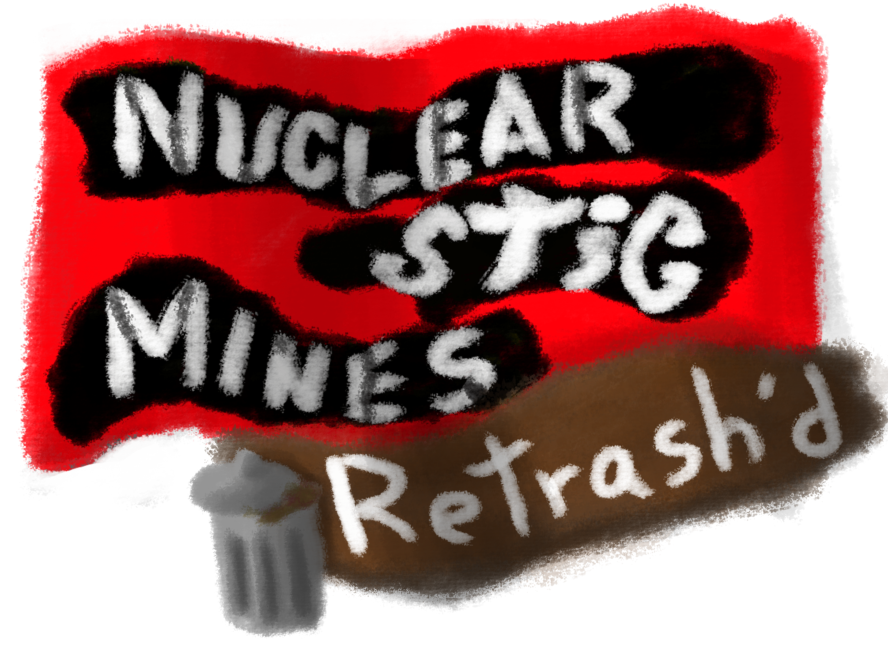
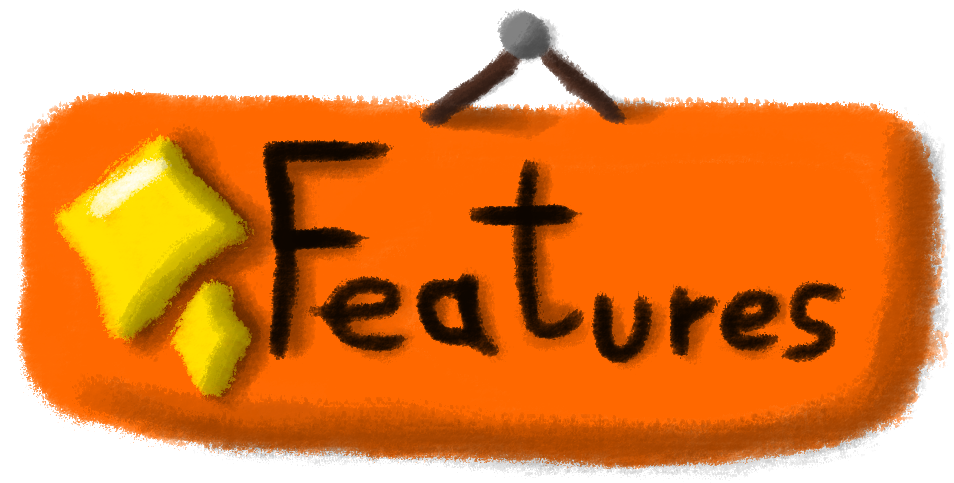
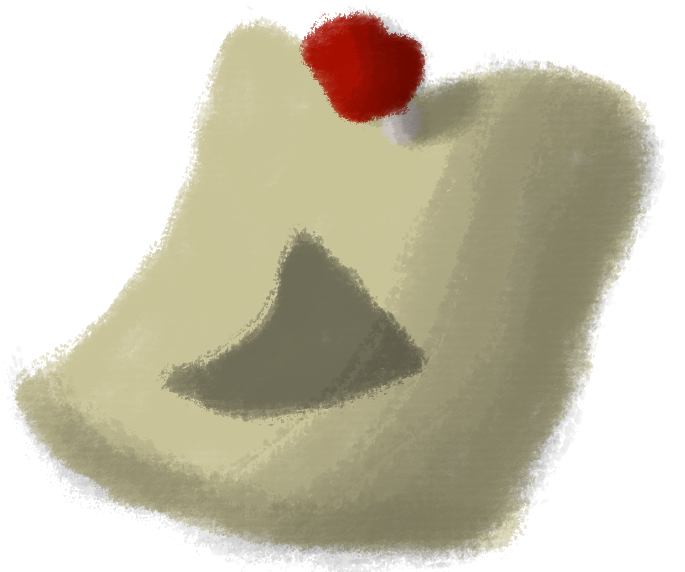
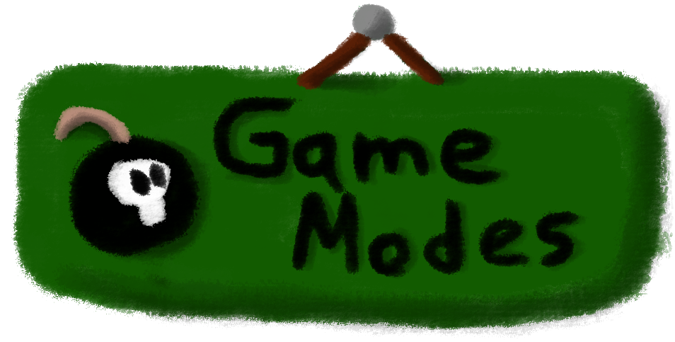
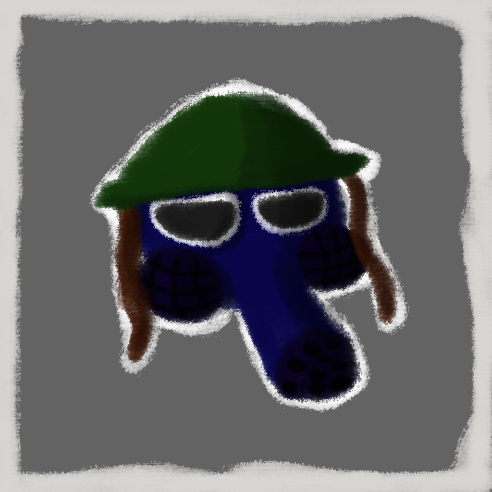
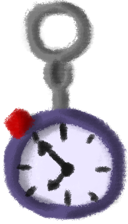
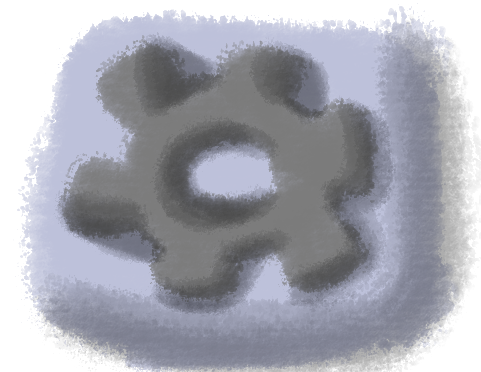
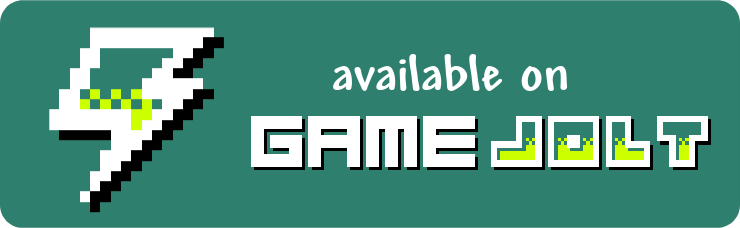

  

# Nuclear-Stic Mines Retrash'd

> **Tactical turn-based roguelike inspired by classic Minesweeper mechanics.**

---

# About

**Nuclear-Stic Mines Retrash'd** is a turn-based tactical roguelike that expands the classic Minesweeper formula into a procedural rescue adventure.

Explore dangerous wastelands, reveal hidden hazards, rescue stranded pals, and return them safely to the shelter. Every map is procedurally generated, every decision matters, and one careless move can end an otherwise perfect run.

---

# How to Play

| Action | Control |
|--------|---------|
| **Move** | `WASD` or Touch Pad |
| **Interact** | `Arrow Keys` or Touch Pad |
| **Change Interaction Mode** | `F` or HUD Button |
| **Pause** | `ESC` |

### Objective

Locate every required **Wanted Pal**, rescue them, and safely return them to the starting shelter while surviving the hazards scattered across the map.

---

# Game Modes

| Mode | Description |
|------|-------------|
| **Legacy** | Endless progression. Every victory increases map size, hazards, obstacles, and overall difficulty while preserving your run progress. |
| **Hardcore** | Separate progression with harsher rules, limited resources, and unforgiving survival mechanics. |
| **Daily** | A worldwide seeded challenge shared by every player. One attempt per day. Build your streak. |
| **Custom** | Customize board size, hazards, obstacles, goals, biome, seeds, and optional Keychains for completely personalized runs. |

---

# Characters

| Character | Ability | Playstyle |
|-----------|---------|-----------|
| **Chef** | Flags automatically neutralize hazards. | Balanced |
| **Mosquito** | Detects nearby hazards and dangerous terrain. | Information |
| **Mommy** | Permanent stat growth after every successful rescue. | Tank |
| **Scout** | Superior mobility. Ignores most terrain restrictions using Jump Flags. | High Risk / High Speed |

---

# Keychains

During a run you may discover **Keychains**, collectible relics that grant passive abilities, utility effects, or dangerous curses.

Only **5 Keychains** may be equipped at once, forcing meaningful decisions throughout the adventure.

Keychains range from simple exploration tools to powerful artifacts that completely change how a run is played. Some even offer tremendous power at equally dangerous costs.

---

# Core Mechanics

| Mechanic | Description |
|----------|-------------|
| **Procedural Generation** | Every board is generated from a seed, allowing identical maps to be replayed or shared. |
| **Fog of War** | Only visible tiles are revealed. Mountains block line of sight. |
| **Terrain Height** | Climbing and falling affect movement. Large drops deal damage. |
| **Hazards** | Hidden dangers include stationary and moving threats that must be identified before advancing. |
| **Flags** | Correctly marking hazards provides score and, depending on your character, unique tactical advantages. |
| **Treasure Tiles** | Rare hidden rewards containing valuable Keychain Bundles. |

---

# Features

- Procedurally generated maps
- Replayable seeded boards
- Four unique playable characters
- Progressive Legacy mode
- Separate Hardcore progression
- Daily worldwide challenges
- Fully customizable sandbox mode
- Collectible Keychains
- Cursed Keychains with risk/reward mechanics
- Multiple terrain types and hazards
- Local save system
- Mobile and Desktop controls

---

# Credits

Created with ❤️ by **imlildud**

Special thanks to everyone who enjoys tactical games, Minesweeper, and discovering that one harmless-looking tile was absolutely not harmless.

---

# Download & Play

| Link | Platform |
| :--- | :--- |
|  | Itch.io |
|  | Game Jolt |